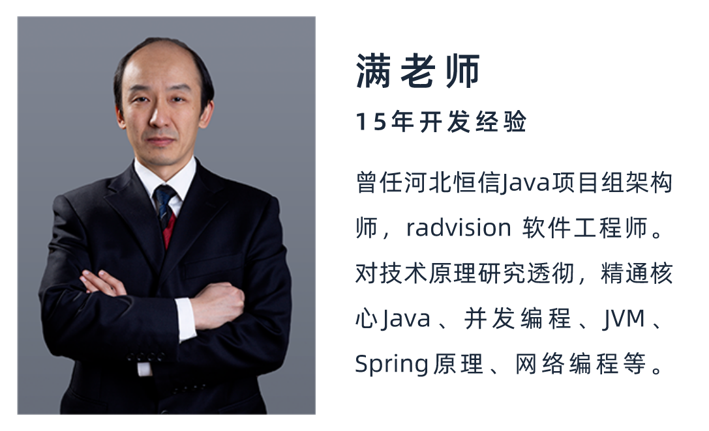

# 数据结构与算法可视化
代码出自黑马程序员 非本人编写  
在线预览： https://q1sj.github.io  
【2023新版Java数据结构与算法视频教程，java高级程序员必会的数据结构与算法】 https://www.bilibili.com/video/BV1Lv4y1e7HL/?share_source=copy_web&vd_source=e632842896a6287f8058df45582dc6fd
  
## 满老师其他课程
- 【黑马程序员Spring视频教程，深度讲解spring5底层原理】 https://www.bilibili.com/video/BV1P44y1N7QG/?share_source=copy_web&vd_source=e632842896a6287f8058df45582dc6fd
- 【黑马程序员深入学习Java并发编程，JUC并发编程全套教程】 https://www.bilibili.com/video/BV16J411h7Rd/?share_source=copy_web&vd_source=e632842896a6287f8058df45582dc6fd
- 【黑马程序员JVM完整教程，Java虚拟机快速入门，全程干货不拖沓】 https://www.bilibili.com/video/BV1yE411Z7AP/?share_source=copy_web&vd_source=e632842896a6287f8058df45582dc6fd
- 【黑马程序员Netty全套教程， netty深入浅出Java网络编程重点教程】 https://www.bilibili.com/video/BV1py4y1E7oA/?share_source=copy_web&vd_source=e632842896a6287f8058df45582dc6fd
- 【Java八股文面试题视频教程，Java面试八股文宝典（含阿里、腾迅大厂java面试真题，java数据结构，java并发，jvm等最新java面试真题）】 https://www.bilibili.com/video/BV15b4y117RJ/?share_source=copy_web&vd_source=e632842896a6287f8058df45582dc6fd
- 【Java程序员用学前端么？java开发所需的前端技术全教程（HTML/CSS/js/vue2/vue3/react）】 https://www.bilibili.com/video/BV1Tt4y1772f/?share_source=copy_web&vd_source=e632842896a6287f8058df45582dc6fd
